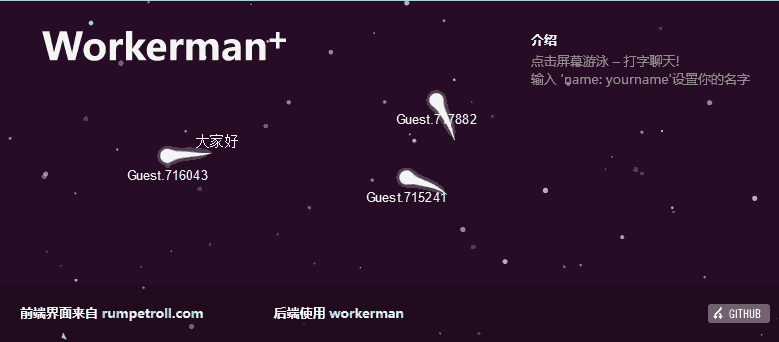

workerman-todpole
=================

蝌蚪游泳交互程序-HTLM5+WebSocket+Workerman , rumpetroll server rewrite using php.

在自己的服务器上安装部署
==================

1、下载或者clone代码到本地

2、进入目录运行./bin/workermand start

3、浏览器访问地址  http://ip:8383 如图：

非常感谢Rumpetroll
===================
本程序是由 [Rumpetroll](http://rumpetroll.com) 修改而来，主要是后台由ruby改成了php。非常感谢Rumpetroll出色的工作。  
[Repo: https://github.com/danielmahal/Rumpetroll](https://github.com/danielmahal/Rumpetroll) 
[Repo: https://github.com/walkor/workerman-todpole](https://github.com/walkor/workerman-todpole)
